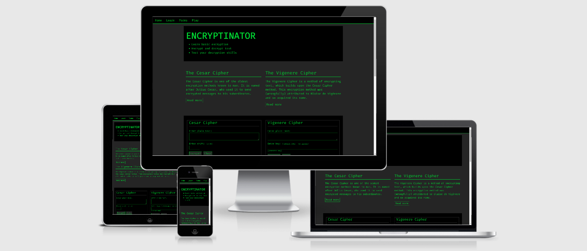

# Encryptinator


[Live website](https://thorole.github.io/encryptinator)

Encryptinator is a command line themed, educational website for people who want to learn basic encryption. Possible users could range
from students of data science all the way down to students in elementary school. This does not exclude any other type of users, of course. Some may simply be interested in the website for the sole purpose of encrypting/decrypting
a message.

 
## UX

### General

The owner of the website recognize the needs for a website that explains the basics of encryption in a non-complex
manner. Its important for the owner that the content of the page is layed out in such a way that it does not
scare off users with too much complexity. The owner also has interests in developing such a site as it easilly
can be used to encrypt/decrypt messages. 

### Typography
The font used for this website was carefully chosen, as it is very important that the font supports the feeling of 
working with the command line. The website uses a font from [Google Fonts'](https://fonts.google.com/) library called [Fira Code](https://fonts.google.com/specimen/Fira+Code?selection.family=Fira+Code&sidebar.open&query=fira+code). This is font that has very much in common with your typical command line font, and most importantly, it's a monotype font. This is the only font used throughout the website.

 ### Colors
 The color theme of the website is very simplistic. All text is green, while backgrounds alternate between black and dark grey. Black and grey is very important to provide some variation against the green text. It also serves the purpose of separating the three main parts of the website.

 There are a few instances across the website where a tone of white is used. Most of these instances are for
 text that needs to stand out, like in the learn section and the alternating green/white "start game" button.

 A tone of orange is used for all error messages in the encryption forms and in the game. 
 

### User Stories


- Upon entering the website, I can immediately see images and text that communicates the purpose/services of the website.

- I want to be able to easily locate the navigation bar, so that I can navigate directly to the content I wish to explore. The
links in the navigation bar are self explanatory.

- On the landing page, I want to to be able to get a quick overview of what Dragon's Den Designs offer, so that I can can decide
if this is something for me. I also want to be able to jump straight to the contact page from the bottom of the landing page.

- As a potential customer, I want to be able to view some example artwork made by the artists behind the website. The example
artwork should be organized into two categories, so that I can get the impression that the artists can handle different types
of artwork.

- I should be able to reach the contact page with a single click from anywhere on the website.

- The contact page should have a form which has fields that I am required to fill in. Some fields should also check that my 
input is in the correct format, like the field for the e-mail address.

### Wireframes

- [Landingpage top](attachments/wireframelandingtop.pdf) | [mobile](attachments/mobilewireframelandingtop.pdf)
- [Landingpage bottom](attachments/wireframelandingbottom.pdf) | [mobile](attachments/mobilewireframelandingbottom.pdf)
- [Gallery](attachments/wireframegallery.pdf) | [mobile](attachments/mobilewireframegallery.pdf)
- [Contact](attachments/wireframecontact.pdf) | [mobile](attachments/mobilewireframecontact.pdf)


## Features

The site is divided into three pages which are all meaningful on their own, meaning, for instance, that the user is not rquired to 
read everything on the landing page to enjoy or understand what's going on in the gallery or contact pages. 

### Existing Features
- [About Us](https://github.com/thorole/dragonsden/blob/master/index.html) - This page, which is also the landing page, allows the user to get an impression of what the website can offer
by reading and viewing images. It's structured as a walkthrough of the process from where the costumer presents and idea and up to the 
point where the artwork is finished. At the bottom of this page there's a dramatic image to showcase what such artwork may look
like when it's finished. 
- [Gallery](https://github.com/thorole/dragonsden/blob/master/gallery.html) - The Gallery page offers example art for the user to view. All of the thumbnails opens up in a modal for able
larger view of the image. This section is also split into two categories:
   - Creatures
   - Sceneries

This way the user can see that the artists master different kinds of motives.

- [Contact Us](https://github.com/thorole/dragonsden/blob/master/contact.html) - This page presents the user with a form. The form asks the user about relevant information
such as name, contact information and a textfield where the user can freely express her-/himself.
The form also asks for optional information about how the user came across the site. This should be useful for the 
owners.

In addition, you may also use this section to discuss plans for additional features to be implemented in the future:

### Features Left to Implement
- The artists behind Dragons's Den are also hosting workshops for people who want to learn to design
their own art. In the feature there will be a page dedicated to a schedule of these workshops.

- The gallery will be divided into more sections: Characters, cities, maps etc.

- Fixed price packages. For instance: 4 character designs, 1 world map, 1 city map - 100$.

## Technologies Used

- [Gitpod](https://gitpod.io/)
- The project is written in [HTML5](https://www.w3.org/) and [CSS3](https://www.w3.org/)
- [Fontawesome](https://fontawesome.com/)
- [Bootstrap](https://www.getbootstrap.com) - The project uses bootstrap for large parts of the layout.
- [Google Fonts](https://fonts.google.com/)
- The project uses JavaScript from [w3schools](https://www.w3schools.com/howto/howto_css_modal_images.asp) in the gallery section to make
images display in modal when clicked. Some of the script was modified by the author of Dragon's Den Designs
to fit the project.
- [Free Formatter](https://www.freeformatter.com/)

  - ***Note:*** *During development, Gitpod's format function was buggy so the code had to be externally formatted
and pasted back into gitpod. This resulted in poor indentation in the first two thirds of the commits.* 


## Testing

In addition to the manual tests beneath, the site has also been tested by other users on Code Institute's Slack room. One 
bug was reported where the user was able to send text through the phone input on the contact page. This error has been fixed.

#### Landing-page
- Clicked all links in navbar, including brand, to make sure the user is directed to the correct section/page: success
- Clicked contact link at bottom of landing page to make sure user is directed to contact page: success
- Clicked contact link at bottom of landing page to make sure user is directed to contact page: success
- Clicked "back to top" link at bottom of landing page to make sure user is directed to top of landing page: success.
- Clicked social media links to check if user is directed to correct social media network: success
- Redused screen size to check that page displays in single column on smaller screens: success

#### Gallery
- Clicked all links in navbar, including brand, to make sure the user is directed to the correct section/page: success
- Clicked all images to make sure they open in modal: success
- Modal closes by clicking anywhere on modal: success
- Redused screen size to make sure gallery displays in two columns instead of four columns on smaller screens: success
- Clicked social media links to check if user is directed to correct social media network: success

#### Contact page
- Clicked all links in navbar, including brand, to make sure the user is directed to the correct section/page: success
- If you try to submit without a valid e-mail address and without input in required fields, there 
    should pop up a message telling the user what's missing: success
- Clicked social media links to check if user is directed to correct social media network: success


### Testing and Responsiveness across browsers and devices
The website was built and tested in Chrome throughout the construction. In addition it has been tested
in Mozilla Firefox, MS Edge and Mac OS Safari. The website is responsive as intended across
all browsers used in testing.

The website has also been tested physically on iPhone S, ipad 2nd gen., iPhone 7 and Mi a2 Redmi note 7.
The website responds well to smaller screen sizes and no major problems have appeared. The intention
is that on medium to small screens the website is layed out in a single column 
(except for the gallery), which it does. During construction the site was constantly tested on phone sized
screen in the Chrome dev. tools to make sure it looked good and behaved as intended.

#### Tools used in testing
- [W3C Markup Validation](https://validator.w3.org/) (30 errors in bootstrap css, 0 errors in html and local style.css) 

- [Accessibility checker](https://www.achecker.ca)
    - 5 problems concerning use of ```<i>``` element (used for fontawsome) The checker suggests using ```<em>``` or ```<strong>```.
      - *Font awsome recommends using the ```<i>``` element for their icons. Font awesome's [guidelines for accessibility](https://fontawesome.com/how-to-use/on-the-web/other-topics/accessibility)
      has been followed to make all font awesome icons accessible.*  
    - Potential problems concerning  elements and ```alt=""``` description being too short. 
      - *All images have ```alt=""``` descriptions. None of the images are semantically important.*
- [Autoprefixer](https://autoprefixer.github.io/)
- [Chrome DevTools](https://developers.google.com/web/tools/chrome-devtools)

## Deployment

**I followed this procedure to deploy Dragon's Den**

1. Navigate to the [repository](https://github.com/thorole/dragonsden)
2. Select [Branch: master]
3. Go to settings
4. Scroll down to "Github Pages". Make sure the repo is set to public in "Danger Zone"-section beneath. 
5. Select [master branch] 
6. Refresh setting page and scroll down to "Github pages" to view the live website URL.

**To clone the repository, follow these instructions:**

1. Navigate to the [repository](https://github.com/thorole/dragonsden)
2. Click **Clone or download**
3. Copy the url from the **Clone or download** dropdown.
4. In cli, navigate to the folder where you want to clone the repository.
5. Type *git clone*, and then paste the URL you copied in Step 3.
6. Press Enter 

For more information, visit [Cloning a repository](https://help.github.com/en/github/creating-cloning-and-archiving-repositories/cloning-a-repository)
on github.

## Credits

### Content
- The function that makes images open in modal when clicked was copied from [w3schools](https://www.w3schools.com/howto/howto_css_modal_images.asp).
- Template for navigation bar copied from [Bootstrap website](https://getbootstrap.com/docs/4.0/components/navbar/)
### Media
- Most of the images on the site, including the hero image was taken from [Pixabay](https://www.pixabay.com) and [wallpaperflare](https://www.wallpaperflare.com)
- Some images also taken from [HD wallpapers](https://www.hdwallpapers.net)
- The dragon icon and favicon was taken from [FreeIconsPng](https://www.freeiconspng.com)


### Acknowledgements

This site inspired some of Dragon's Den's layout:
https://www.unicef.org/child-rights-convention 
